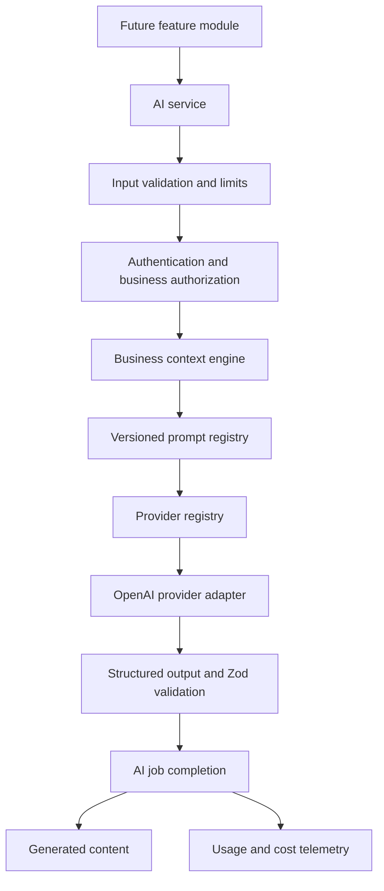
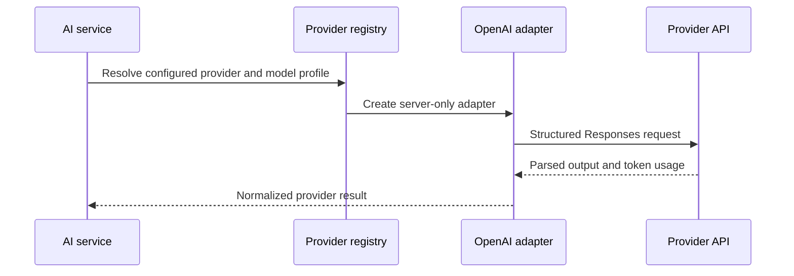

# DigiSprint AI Core Platform

Version 1.4 is the reusable, server-only AI foundation for every future DigiSprint AI module. It does not implement marketing strategies, posts, images, publishing, analytics or an assistant UI.

## Architecture diagram

Feature modules must call `runAIRequest`. They must never import a provider SDK directly.

## AI request lifecycle

1. A feature supplies its business ID, feature key, registered prompt key, typed input and idempotency key.
2. The platform validates identifiers, payload size and the prompt input schema.
3. The server authenticates the user and verifies active membership of the requested business.
4. Business AI settings are loaded. Disabled AI immediately stops the request.
5. The context engine assembles a bounded snapshot from business, brand and content preferences. Context opt-out removes descriptive, audience, platform and goal data before provider processing or storage.
6. The prompt registry resolves the immutable prompt key, version, schemas and model profile.
7. Environment configuration resolves the provider model and token-cost rates. Missing configuration fails closed.
8. `start_ai_job` records the request before any external provider call.
9. The provider adapter calls the Responses API with schema-constrained output.
10. Zod validates the provider result before it can be persisted.
11. `complete_ai_job` stores generated content and usage telemetry and marks the job successful in one transaction.
12. A normalized failure marks an active job failed without returning provider internals to the client.

## Provider flow

The provider name, API key and every active model name are environment-controlled. Application code contains no model identifiers. Model changes require environment updates only:

- `AI_PROVIDER`
- `AI_API_KEY`
- `AI_MODEL_FAST`
- `AI_MODEL_BALANCED`
- `AI_MODEL_QUALITY`
- `AI_INPUT_COST_PER_1M_TOKENS`
- `AI_OUTPUT_COST_PER_1M_TOKENS`

## Prompt lifecycle

1. Define a stable prompt key.
2. Define strict Zod input and output schemas.
3. Add immutable system instructions and a bounded context renderer.
4. Assign a positive prompt version and model profile.
5. Register the prompt centrally.
6. Store the prompt key and version with the job, generated content and usage event.
7. Introduce behavioral prompt changes as a new version; never silently rewrite historical behavior.

Only the internal diagnostic prompt exists in Version 1.4. It cannot generate product content.

## Business context engine

The context snapshot may include business name, industry, description, location, audience, brand tone, languages, platforms, goals and weekly cadence. It excludes credentials, provider keys, account secrets and unrelated tenant data. Zod limits each field and collection before prompting or storage.

## Database tables

### `ai_settings`

Business-level AI enablement, model profile, content language, creativity profile, request limit, output-token ceiling and context-processing preference. Existing businesses are backfilled and new businesses receive defaults through a trigger.

### `ai_jobs`

Auditable request lifecycle containing feature, prompt version, provider, model, input, context snapshot, idempotency key, status, provider request ID, tokens, duration and normalized failure information.

### `generated_content`

Schema-validated provider output stored independently from strategies, posts or other future product entities. Status supports later acceptance, editing, rejection and archival workflows.

### `ai_usage_events`

Immutable telemetry containing input, output and total tokens; estimated input, output and total cost; duration; provider; model; feature key; prompt version; business; user and job identity.

## Security model

- Provider credentials and model configuration are server-only environment values.
- Server Components and feature modules cannot access the API key.
- Authentication uses the verified Supabase server session.
- Active business membership is checked before context access or job creation.
- RLS isolates all AI records by business membership.
- Direct inserts into jobs, generated content and usage tables are revoked.
- Lifecycle RPCs are security-definer functions that re-check `auth.uid()` and ownership.
- Generated-content updates are restricted to explicitly editable columns.
- Inputs are bounded and schema-validated; outputs are schema-validated before storage.
- Idempotency uniqueness prevents duplicate business requests.
- Provider exceptions are mapped to safe application error codes.
- Generated text remains untrusted and must be escaped in every future UI.

## Migration strategy

`0004_ai_core_platform.sql` is additive and rerunnable:

- Existing tables and Version 1.1-1.3 rows are not deleted or rewritten.
- Existing `ai_jobs` receives nullable/additive telemetry columns.
- Enum creation tolerates an existing type.
- Tables use `if not exists`.
- Columns and indexes use `if not exists`.
- Policies are recreated transactionally by stable names.
- The settings backfill uses `on conflict do nothing`.
- The business trigger is safely replaced.
- RLS is explicitly enabled on every new table.

## Future extension points

- Version 1.5 registers Marketing Strategy schemas and prompts.
- Version 1.6 registers content-studio prompt families and transforms accepted output into post records.
- Version 1.7 adds an image-prompt provider capability without changing text-provider contracts.
- Version 1.8 consumes accepted content through publishing adapters and schedules.
- Version 1.9 aggregates immutable usage and content outcomes for analytics.
- Version 2.0 orchestrates approved feature services through the AI Business Assistant.
- Additional providers implement the same structured provider interface and register centrally.
- Pricing changes use environment cost rates without changing application code.

## File manifest

- `lib/ai/service.ts` - lifecycle orchestration
- `lib/ai/config.ts` - environment-only provider configuration
- `lib/ai/settings.ts` - business AI controls
- `lib/ai/providers/` - provider contract, registry and OpenAI adapter
- `lib/ai/prompts/` - prompt definitions, versions, registry and renderer
- `lib/ai/context/` - bounded business-context assembly
- `lib/ai/security/` - authorization and request limits
- `lib/ai/storage/` - job and generated-content persistence
- `lib/ai/usage/` - environment-priced usage estimation
- `lib/ai/testing/` - deterministic provider test double
- `supabase/migrations/0004_ai_core_platform.sql` - additive schema, RLS, indexes and lifecycle RPCs

## Testing strategy

Validation covers linting, strict TypeScript compilation, production compilation and whitespace errors. The provider test double enables later unit coverage for prompt rendering, output validation, provider failures and service orchestration without external calls. Database integration tests must apply migrations twice, verify RLS across two businesses, exercise successful and failed lifecycle transitions, confirm idempotency and assert all token/cost totals.

## Version 1.5 consumer: Marketing Strategy Engine

The first production consumer follows the unchanged AI Core boundary: authenticated feature action → `runAIRequest()` → prompt registry → business context → provider registry → structured validation → generated content and usage telemetry.

Feature modules must not import OpenAI, read provider secrets, or call provider APIs. New consumers register a versioned prompt, define bounded input/output schemas, use server-derived business identity, preserve idempotency, and store successful structured results through the generated-content system.

The strategy consumer adds deterministic business-context caching without changing the core schema. Future consumers should use the same extension contract. Reserved families are `daily_post`, `festival_post`, `seo_audit`, `website_copy`, `email_campaign`, `ad_copy`, `social_calendar`, `resume_builder`, and `mini_profile`; none are implemented in Version 1.5.